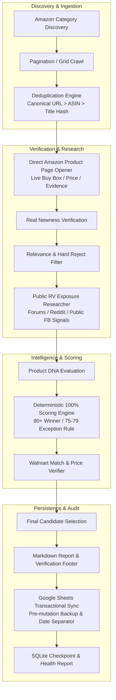

# RV Winner Scout 🚐✨

> **Automated RV Product Research & Affiliate Discovery System**
> Discover emerging products from Amazon's RV Parts & Accessories ecosystem with viral/high-CTR potential for public RV communities.

---

## Table of Contents
1. [Core Principles](#core-principles)
2. [Pipeline Architecture](#pipeline-architecture)
3. [Strict 15-Stage Pipeline Sequence](#strict-15-stage-pipeline-sequence)
4. [Product DNA & 100% Scoring Rubric](#product-dna--100-scoring-rubric)
5. [Reliability & Fail-Closed Safety](#reliability--fail-closed-safety)
6. [AI Provider Abstraction & GLM Reasoning Protection](#ai-provider-abstraction--glm-reasoning-protection)
7. [Cross-Market Walmart Verification](#cross-market-walmart-verification)
8. [Google Sheets Transactional Sync](#google-sheets-transactional-sync)
9. [Installation & Configuration](#installation--configuration)
10. [CLI Usage & Test Modes](#cli-usage--test-modes)
11. [GitHub Actions Automation](#github-actions-automation)
12. [Testing & Quality Assurance](#testing--quality-assurance)

---

## Core Principles

The engine adheres to three foundational tenets:
* **Accuracy > Completeness**
* **Stability > Speed**
* **Honest Verification > Assumptions**

### Zero Fabrication Policy
The system **never fabricates**:
* Product facts, bullet points, or specifications
* Live displayed prices
* ASINs or Canonical URLs
* Real-world newness or launch dates
* Public social exposure levels or community evidence
* Walmart availability or alternative product prices
* Verification results

If a source cannot be accessed or verified, it is recorded honestly as `NOT VERIFIED`, `URL NOT FOUND`, or `SOURCE UNAVAILABLE — [exact reason]`. No human review is required during normal operation.

---

## Pipeline Architecture



---

## Strict 15-Stage Pipeline Sequence

The pipeline executes in strict chronological order. Products are **never scored before mandatory verification**.

1. **Amazon Discovery**: Recursive discovery of New Releases subcategories under automotive category `2258019011`.
2. **Complete Crawl**: Crawls accessible product faceouts, titles, ASINs, initial prices, and thumbnails.
3. **Deduplication**: Canonical URL as primary key (`https://www.amazon.com/dp/{asin}`), with ASIN and normalized title fingerprint as supporting checks.
4. **Amazon Product-Page Verification**: Every candidate is opened directly to verify live buy box, real displayed price, and actual specifications.
5. **Newness Evaluation**: Supported by verifiable evidence (e.g. `Date First Available`), never assumed.
6. **RV Relevance Evaluation**: Evaluated against the 18 specific RV pain points. Mandatory hard-reject of ubiquitous staples and ultra-niche mechanical replacements.
7. **Public RV Exposure Research**: Targeted queries across public indexed sources (Reddit, iRV2, Forest River, public Facebook).
8. **Product DNA**: Evaluates viral discovery angles, stop-scroll visual demonstration hooks, and space-saving problem solving.
9. **AI Evaluation & Scoring**: Dual provider abstraction (Gemini / TokenRouter) enforcing strict Pydantic JSON schemas.
10. **Walmart Research**: Verifies direct alternative existence, live Walmart URL, and verified price.
11. **Final Selection**: Candidates meeting threshold (or verified exceptions) are selected.
12. **Final Report**: Generates formatted Markdown report with Core Facts, Opportunity, Action, Evidence, and Why Next Winner.
13. **Google Sheets Update**: Atomically appends validated winners below a full-width daily date separator.
14. **Backup**: Local timestamped JSON backups created prior to any mutations.
15. **Health Report**: Emits telemetry, source failures, degradation notices, and audit ledger.

---

## Product DNA & 100% Scoring Rubric

The scoring engine evaluates products on the feeling: *"I didn't know this existed."*

### Mathematical Weight Distribution (Sum = 100%)
| Dimension | Weight | Target Assessment |
| :--- | :---: | :--- |
| **Facebook Discovery Potential** | **20%** | Viral stop-scroll curiosity, unfamiliarity, impulse reaction |
| **RV Facebook Exposure** | **15%** | Scarcity in communities (Very Low / Low rewarded) |
| **RV Relevance** | **15%** | Solves genuine RV lifestyle pain points |
| **Novelty / Newness** | **15%** | Fresh mechanism, unexpected function, emerging item |
| **Problem-Solving Power** | **10%** | Solves a specific frustrating camper problem |
| **Visual / WOW** | **10%** | Easy demonstration, clear transformation, before/after |
| **Space / Convenience** | **5%** | Space-saving, collapsible, compact, multipurpose |
| **Impulse Click Potential** | **5%** | Broad curiosity and attractive price point (< $100) |
| **RV Audience Breadth** | **5%** | Relevant to towables, motorhomes, and campers alike |

### Winner Verdict Rules
* **Winner Threshold**: Score **$\ge 80.0$**
* **Exception Rule (75.0 – 79.9)**: Qualifies **ONLY IF**:
  1. Social Exposure is `VERY LOW` or `LOW`
  2. Exceptional novelty/discovery score ($\ge 8.5/10$)
  3. Strong "I didn't know this existed" reaction
  4. Strong RV relevance score ($\ge 8.0/10$)
  * Labeled as: `EXCEPTION — HIGH-POTENTIAL BELOW THRESHOLD`
* **Sub-75**: Strict rejection.

### The "No Winner" Rule
If no product reaches the criteria, the system outputs **EXACTLY**:
> *"I reviewed [NUMBER] products from the link. None met the hidden-winner criteria today."*
Followed by the Top 3 Near Misses and the primary failure bottleneck. The threshold is **never** lowered to force winners.

---

## Reliability & Fail-Closed Safety

* **Anti-Bot & CAPTCHA**: The system **never** attempts to bypass robot checks or CAPTCHA challenges. Upon detection, it raises `AntiBotBlockedException`, trips the circuit breaker, checkpoints current progress, and fails closed with `SOURCE UNAVAILABLE`.
* **Polite Jittered Rate Limiter**: Randomized delay between 2.0s and 5.0s between requests with realistic modern browser headers.
* **3-State Circuit Breaker**: Tracks failures per provider/host (`CLOSED` $\rightarrow$ `OPEN` $\rightarrow$ `HALF_OPEN`) with cooldown resets.
* **Exclusive Run Lock**: Uses filesystem locking (`.run.lock`) with stale-lock expiration (2 hours) to avoid concurrent executions.
* **Global Deadline Guard**: 45-minute execution limit. Halts new discoveries when $< 5$ minutes remain to flush in-flight verifications.
* **Dead-Letter Quarantine**: Malformed payloads or API schema anomalies are saved to SQLite `dead_letter` table without crashing the run.

---

## AI Provider Abstraction & GLM Reasoning Protection

Supports **Google Gemini** (`gemini-3.8-flash`) and **TokenRouter** (`z-ai/glm-5.3-free`).

### GLM Reasoning Safety Guardrail
When using TokenRouter models with reasoning output:
* `reasoning_content` is **NEVER** returned as the answer.
* If `message.content` is null and `finish_reason == "length"` with existing `reasoning_content`, the adapter raises `AITokenBudgetExhaustedError` and fails closed.

### Failover Policy
* Failover occurs **ONLY** on transient errors (HTTP 429 rate limit, timeouts, HTTP 503).
* Failover is **NEVER** attempted for authentication errors, schema violations, or business rejections.

---

## Cross-Market Walmart Verification

Every qualified candidate undergoes real Walmart cross-search:
* Executes a clean 3–4 word product search on Walmart.
* Parses candidate result cards and inspects title token overlap to determine direct alternatives.
* Captures verified live URL and displayed price.
* Honestly reports `FOUND`, `NOT FOUND`, `URL NOT FOUND`, or `NOT VERIFIED`.

---

## Google Sheets Transactional Sync

* **Single Sheet / Single Worksheet**: Keeps historical records in chronological order.
* **Daily Full-Width Date Separator**: Inserts a distinct banner row before new entries:
  `==================== 2026-09-14 ====================`
* **Pre-Mutation Snapshot**: Automatically writes a local JSON backup before writing rows.
* **Degraded Guard**: If the run was degraded or verifications failed, auto-publish is suspended.

---

## Installation & Configuration

### Prerequisites
* Python 3.13+
* pip

### Installation
```bash
git clone https://github.com/your-org/rv-winner-scout.git
cd rv-winner-scout
pip install -r requirements.txt
pip install -r requirements-dev.txt
```

### Environment Configuration
Copy `.env.example` to `.env`:
```bash
cp .env.example .env
```

Configure the following variables in `.env`:
```ini
AI_PROVIDER=gemini
AI_MODEL=gemini-3.8-flash
AI_API_KEY=your_gemini_api_key

TOKENROUTER_API_KEY=your_tokenrouter_key
TOKENROUTER_MODEL=z-ai/glm-5.3-free

SPREADSHEET_ID=your_spreadsheet_id
SHEET_NAME=RV Research
GOOGLE_SHEETS_CREDENTIALS_JSON=credentials.json

RUN_MODE=smoke
MAX_PRODUCTS_PER_RUN=10
```

---

## CLI Usage & Test Modes

### 1. Smoke Mode (1 category, 5 products — ideal for local verification)
```bash
python run.py --mode=smoke
```

### 2. Small Mode (2 categories, 15 products)
```bash
python run.py --mode=small
```

### 3. Full Production Mode
```bash
python run.py --mode=full
```

### Custom Report Destination
```bash
python run.py --mode=smoke --output=data/reports/daily_winner.md
```

---

## GitHub Actions Automation

The repository includes a production workflow `.github/workflows/daily_scout.yml`:
* **Schedule**: Automated daily run at `06:10 UTC`.
* **Manual Trigger**: Supports `workflow_dispatch` with custom run mode selection.
* **Security**: Reads API keys and Google credentials securely from GitHub Secrets.
* **Artifacts**: Uploads `data/reports/`, `data/backups/`, and `data/checkpoint.db` with 7-day retention.

---

## Testing & Quality Assurance

The codebase includes comprehensive unit, golden DOM, and end-to-end integration tests with zero external network dependencies required during CI:

```bash
python -m pytest tests/ -v
```

### Test Coverage Highlights
* `test_scoring.py`: 100% mathematical weight verification, threshold bounds, 75–79 exception rules.
* `test_ai_adapters.py`: GLM reasoning token exhaustion guardrails, schema validation, transient failover.
* `test_amazon_dom.py`: Golden DOM parsing against realistic Amazon New Releases and product page fixtures.
* `test_anti_bot.py`: CAPTCHA, 403, 503, and DOM anomaly detection.
* `test_deduplication.py`: Canonical URL normalization and hash collision defense.
* `test_pipeline_e2e.py`: Full 15-stage pipeline smoke simulation and strict No-Winner fallback validation.

---

## License
MIT License. Built for production RV affiliate discovery and intelligence.
